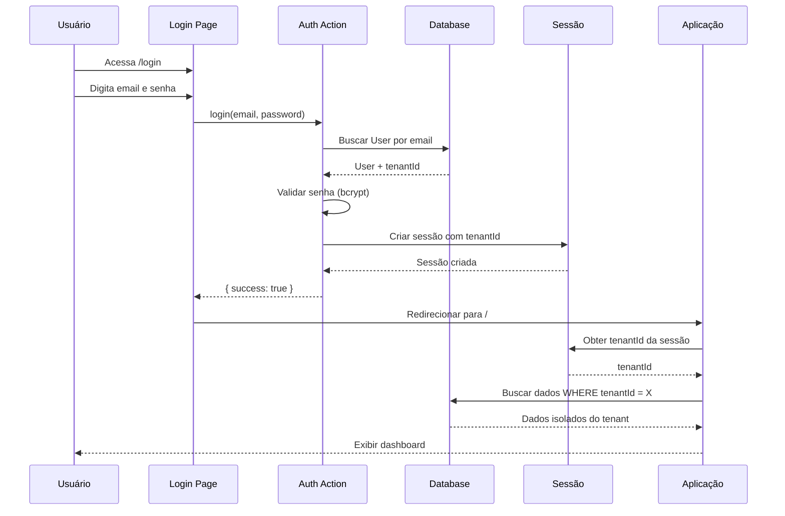

# Multi-Tenancy - Isolamento de Dados

**Versão:** 2.0.0  
**Data:** 26/12/2025  
**Autor:** Paige (Senior Technical Writer) 📚

---

## 📋 Visão Geral

O CRM FourSys implementa **Row-Level Security** (Segurança em Nível de Linha) para isolamento completo de dados entre organizações (tenants). Cada tenant representa uma empresa cliente que utiliza o sistema, e seus dados são completamente isolados dos demais.

### Modelo Implementado

**Shared Database, Shared Schema** com isolamento por `tenantId`:
- ✅ Todos os tenants compartilham o mesmo banco de dados
- ✅ Todos os tenants compartilham o mesmo esquema (tabelas)
- ✅ Isolamento garantido por filtros automáticos em nível de aplicação
- ✅ Performance otimizada com índices compostos

---

## 🔒 Princípios Fundamentais

### 1. Tenant Fixo na Sessão

O `tenantId` é capturado **automaticamente** durante o login e armazenado na sessão do usuário. O sistema **NUNCA** aceita `tenantId` como parâmetro vindo do cliente.

```typescript
// ✅ CORRETO: Obter tenantId da sessão
const tenantId = await requireTenant();

// ❌ ERRADO: NUNCA aceitar tenantId do cliente
export async function getLeads(tenantId: string) { // PERIGOSO!
  // Isso permitiria que um usuário acesse dados de outros tenants
}
```

### 2. Invisibilidade para o Usuário

O usuário **não vê** e **não interage** com o conceito de "tenant". Para ele, o sistema simplesmente mostra "seus dados".

- ❌ Sem seletores de tenant na UI
- ❌ Sem campos de tenant em formulários
- ❌ Sem menção a "tenant" em mensagens
- ✅ Isolamento transparente e automático

### 3. Validação em Todas as Operações

Toda operação de leitura ou escrita **DEVE**:
1. Obter o `tenantId` da sessão
2. Filtrar/validar por `tenantId`
3. Nunca confiar em dados do cliente

---

## 🔐 Fluxo de Autenticação e Captura de Tenant



### Explicação do Fluxo

1. **Login:** Usuário fornece credenciais
2. **Autenticação:** Sistema valida e busca usuário no banco
3. **Captura de Tenant:** `tenantId` é extraído do registro do usuário
4. **Criação de Sessão:** Sessão é criada com `tenantId` embutido
5. **Isolamento Automático:** Todas as queries subsequentes filtram por `tenantId`

---

## 🛡️ Implementação de Segurança

### Função `requireTenant()`

Localização: `src/lib/auth.ts`

```typescript
/**
 * Obter tenantId da sessão (OBRIGATÓRIO em todas as Server Actions)
 * 
 * @throws Error se usuário não autenticado
 * @returns tenantId da sessão
 */
export async function requireTenant(): Promise<string> {
  const session = await auth();
  
  if (!session?.user?.tenantId) {
    throw new Error('Usuário não autenticado ou sem tenant');
  }
  
  return session.user.tenantId;
}
```

### Uso em Server Actions

**Padrão Obrigatório:**

```typescript
export async function getLeads(): Promise<ActionResult<Lead[]>> {
  try {
    // 1. SEMPRE obter tenantId da sessão
    const tenantId = await requireTenant();
    
    // 2. Filtrar por tenantId
    const leads = await prisma.lead.findMany({
      where: {
        tenantId // ← ISOLAMENTO
      },
      orderBy: [
        { aiScore: 'desc' },
        { createdAt: 'desc' }
      ]
    });
    
    return {
      data: leads as Lead[],
      success: true,
    };
  } catch (error) {
    return {
      data: [],
      error: 'Erro ao carregar leads',
      success: false,
    };
  }
}
```

### Validação de Propriedade

Antes de atualizar ou deletar, **SEMPRE** validar que o registro pertence ao tenant:

```typescript
export async function updateLead(input: UpdateLeadInput): Promise<Lead> {
  try {
    // 1. Obter tenantId da sessão
    const tenantId = await requireTenant();
    
    // 2. VALIDAR que o lead pertence ao tenant
    const existingLead = await prisma.lead.findUnique({
      where: { id: input.id },
      select: { tenantId: true }
    });
    
    if (!existingLead) {
      throw new Error('Lead não encontrado');
    }
    
    if (existingLead.tenantId !== tenantId) {
      throw new Error('Acesso negado: Lead não pertence ao seu tenant');
    }

    // 3. Atualizar com double-check no WHERE
    const lead = await prisma.lead.update({
      where: { 
        id: input.id,
        tenantId // ← DOUBLE-CHECK
      },
      data: {
        ...cleanData,
        lastContact: new Date()
      }
    });

    return lead as Lead;
  } catch (error) {
    throw new Error('Falha ao atualizar lead');
  }
}
```

---

## 📊 Estrutura de Dados

### Modelo Tenant

```prisma
model Tenant {
  id        String   @id @default(uuid())
  name      String   // Nome da empresa (ex: "FourSys Ltda")
  slug      String   @unique // URL-friendly (ex: "foursys")
  domain    String?  // Domínio customizado (opcional)
  isActive  Boolean  @default(true) // Soft delete
  createdAt DateTime @default(now())
  updatedAt DateTime @updatedAt
  
  // Relações
  leads     Lead[]
  users     User[]
  
  @@index([slug])
  @@index([isActive])
}
```

### Modelo User

```prisma
model User {
  id        String   @id @default(uuid())
  tenantId  String   // ← Foreign Key para Tenant
  email     String   @unique
  name      String
  password  String   // Hash bcrypt
  role      String   @default("user")
  isActive  Boolean  @default(true)
  createdAt DateTime @default(now())
  updatedAt DateTime @updatedAt
  
  tenant    Tenant   @relation(fields: [tenantId], references: [id], onDelete: Cascade)
  
  @@index([tenantId])
  @@index([email])
}
```

### Modelo Lead

```prisma
model Lead {
  id          String   @id @default(uuid())
  tenantId    String   // ← Foreign Key para Tenant
  name        String
  company     String
  status      String
  value       Float
  aiScore     Int
  email       String?
  phone       String?
  lastContact DateTime @default(now())
  createdAt   DateTime @default(now())
  updatedAt   DateTime @updatedAt
  
  tenant      Tenant   @relation(fields: [tenantId], references: [id], onDelete: Cascade)
  
  // Índices CRÍTICOS para performance
  @@index([tenantId])
  @@index([tenantId, status])
  @@index([tenantId, aiScore])
  @@index([tenantId, createdAt])
  
  // Constraints de unicidade POR TENANT
  @@unique([email, tenantId], name: "unique_email_per_tenant")
  @@unique([phone, tenantId], name: "unique_phone_per_tenant")
}
```

---

## ⚡ Performance e Índices

### Índices Compostos

Todos os modelos multi-tenant possuem índices compostos começando com `tenantId`:

```prisma
@@index([tenantId])              // Query básica por tenant
@@index([tenantId, status])      // Kanban board
@@index([tenantId, aiScore])     // Ordenação por score
@@index([tenantId, createdAt])   // Ordenação por data
```

### Por que Índices Compostos?

1. **Performance:** Queries filtradas por tenant são extremamente rápidas
2. **Cobertura:** Índice cobre tanto o filtro quanto a ordenação
3. **Escalabilidade:** Mantém performance mesmo com milhões de registros

### Exemplo de Query Otimizada

```sql
-- Esta query usa o índice composto [tenantId, status]
SELECT * FROM Lead 
WHERE tenantId = 'abc123' AND status = 'prospect'
ORDER BY aiScore DESC;
```

---

## 🔍 Prevenção de Vazamento de Dados

### Checklist de Segurança

Toda Server Action **DEVE**:

- [ ] Usar `requireTenant()` para obter `tenantId`
- [ ] Filtrar queries por `tenantId`
- [ ] Validar propriedade antes de update/delete
- [ ] Usar `tenantId` no WHERE de updates/deletes
- [ ] **NUNCA** aceitar `tenantId` como parâmetro
- [ ] **NUNCA** retornar dados de outros tenants
- [ ] Tratar erros sem expor informações sensíveis

### Exemplo de Vulnerabilidade

```typescript
// ❌ VULNERÁVEL: Aceita tenantId do cliente
export async function getLeads(tenantId: string) {
  // Atacante poderia passar qualquer tenantId
  const leads = await prisma.lead.findMany({
    where: { tenantId }
  });
  return leads;
}

// ✅ SEGURO: Obter tenantId da sessão
export async function getLeads() {
  const tenantId = await requireTenant(); // Da sessão!
  const leads = await prisma.lead.findMany({
    where: { tenantId }
  });
  return leads;
}
```

---

## 🧪 Testando Isolamento

### Teste Manual

1. Criar dois usuários de tenants diferentes
2. Fazer login com usuário A
3. Criar leads
4. Fazer login com usuário B
5. Verificar que não vê leads do usuário A

### Teste Automatizado (Exemplo)

```typescript
describe('Multi-Tenancy Isolation', () => {
  it('should not return leads from other tenants', async () => {
    // Criar dois tenants
    const tenant1 = await createTenant('Tenant 1');
    const tenant2 = await createTenant('Tenant 2');
    
    // Criar leads em cada tenant
    await createLead({ tenantId: tenant1.id, name: 'Lead 1' });
    await createLead({ tenantId: tenant2.id, name: 'Lead 2' });
    
    // Autenticar como tenant1
    const session1 = await authenticate(tenant1.userId);
    const leads1 = await getLeads(); // Usa session1
    
    // Verificar isolamento
    expect(leads1).toHaveLength(1);
    expect(leads1[0].name).toBe('Lead 1');
    expect(leads1[0].tenantId).toBe(tenant1.id);
  });
});
```

---

## 📚 Referências

### Arquivos Relacionados

- `src/lib/auth.ts` - Funções de autenticação e `requireTenant()`
- `src/app/actions/leads.ts` - Exemplo de implementação
- `prisma/schema.prisma` - Definição dos modelos

### Documentação Externa

- [Row-Level Security Best Practices](https://www.prisma.io/docs/guides/database/multi-tenancy)
- [Next.js Authentication](https://nextjs.org/docs/app/building-your-application/authentication)

---

## ⚠️ Avisos Importantes

### 🚨 NUNCA Faça Isso

```typescript
// ❌ Aceitar tenantId do cliente
export async function getLeads(tenantId: string) { }

// ❌ Não validar propriedade antes de atualizar
export async function updateLead(id: string, data: any) {
  await prisma.lead.update({ where: { id }, data });
}

// ❌ Retornar dados sem filtrar por tenant
export async function getAllLeads() {
  return await prisma.lead.findMany(); // PERIGOSO!
}
```

### ✅ SEMPRE Faça Isso

```typescript
// ✅ Obter tenantId da sessão
const tenantId = await requireTenant();

// ✅ Filtrar por tenantId
where: { tenantId }

// ✅ Validar propriedade
if (existingLead.tenantId !== tenantId) {
  throw new Error('Acesso negado');
}

// ✅ Double-check no WHERE
where: { id, tenantId }
```

---

**Documentado por:** Paige (Senior Technical Writer) 📚  
**Versão:** 2.0.0  
**Data:** 26/12/2025  
**Status:** ✅ Completo e Validado

